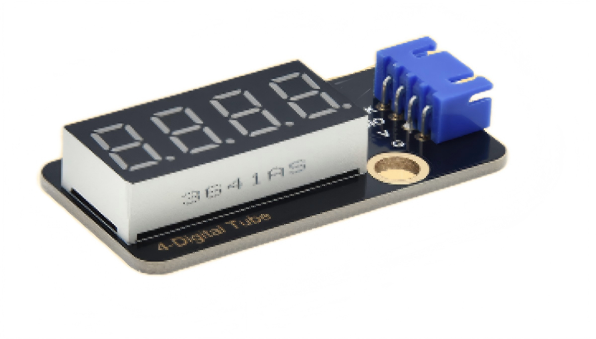
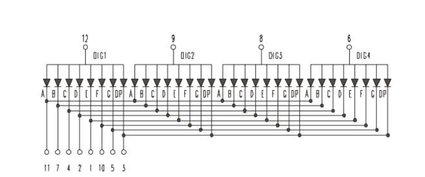
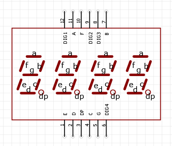
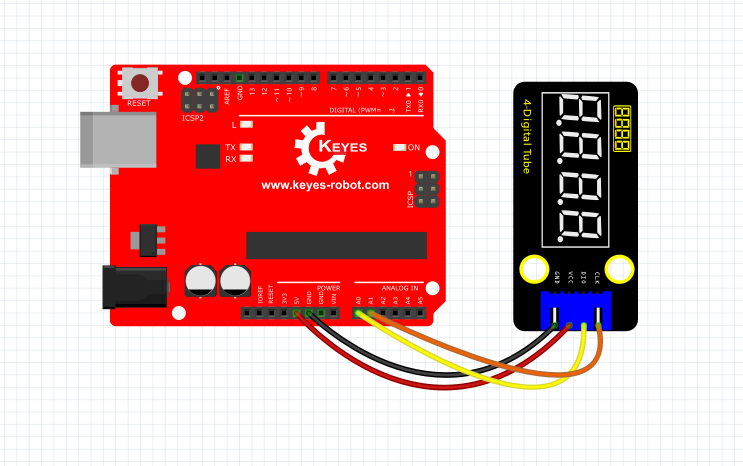
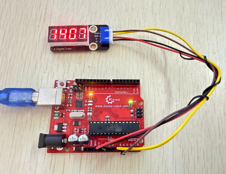

# KE4060 Keyes 2021新款 DIY电子积木 TM1650四位数码管模块 黑色环保（蓝色端子）

 

## 1. 介绍

这个模块主要由一个0.36英寸 红色共阴 4位数码管组成，它的驱动芯片是TM1650。使用时，我们只需要2根信号线即可使单片机控制4位8数码管，大大节约了控制板IO口资源。  

模块兼容各种单片机控制板，如arduino系列单片机。使用时，我们可以在单片机上堆叠一个传感器扩展板。模块和自带导线连接，然后连接在传感器扩展板上，简单方便。同时，模块自带2个直径为4.8mm的定位孔，方便你将模块固定在其他设备。  

## 2. 规格参数

- 工作电压：DC 5V
- 电流：100MA
- 最大功率：0.5W
- 尺寸：47.6MM \*23.8MM
- 工作温度：\-10摄氏度 到 +50摄氏度
- 接口：间距为2.54mm 4pin
- 定位孔大小：直径为4.8mm
- 数码管显示颜色：红色

## 3. 工作原理

**共阳极数码管**：
四位共阳极数码管模块上有四组完全相同的段选线排列，分别对应四个独立的数码管。每组都包含A、B、C、D、E、F、G、DP这八个段，这些段选线在内部是并联连接的。
每个数码管都有一个独立的公共阳极（位选端）。当某个公共阳极被给予高电平（5V），同时对应的段选线被给予低电平时，该段导通LED发光。  
通过两线串行接口与单片机通信，内部自动完成位选扫描和段选驱动的工作。单片机只发送需要显示的数据，TM1650会按照设定的亮度，以很高的扫描频率依次点亮各个数码管。每个瞬间只有一个数码管被点亮，以极快的速度在4个数码管之间循环切换，利用人眼的视觉暂留效应，看到的是四个数字同时稳定显示的效果。  
  

  

**TM1650数码管**：
TM1650 是一种带键盘扫描接口的 LED（发光二极管显示器）驱动控制专用电路。内部集成有 MCU输入输出控制数字接口、数据锁存器、LED 驱动、键盘扫描、辉度调节等电路。TM1650 性能稳定、质量可靠、抗干扰能力强，可适用于 24 小时长期连续工作的应用场合。TM1650 采用 2 线串行传输协议通讯（注意该数据传输协议不是标准的I2C协议）。该芯片只需要通过二个引脚与MCU通讯就可以完成数码管的驱动，可以节省MCU引脚资源。

**数据命令设置**：0x48，这个是告诉TM1650，我们要用点亮数码管的功能，而不是按键扫描的功能

| B7 | B6 | B5 | B4 | B3 | B2 | B1 | B0 | 功能 | 说明 |
| ---| ---| ---| ---| ---| ---| ---| ---| ---| ---|
|  × | 0 | 0 | 0 |   | × | × |   | 辉度设置 | 8级亮度 |
|  × | 0 | 0 | 1 |   | × | × |   | 辉度设置 | 1级亮度 |
|  × | 0 | 1 | 0 |   | × | × |   | 辉度设置 | 2级亮度 |
|  × | 0 | 1 | 1 |   | × | × |   | 辉度设置 | 3级亮度 |
|  × | 1 | 0 | 0 |   | × | × |   | 辉度设置 | 4级亮度 |
|  × | 1 | 0 | 1 |   | × | × |   | 辉度设置 | 5级亮度 |
|  × | 1 | 1 | 0 |   | × | × |   | 辉度设置 | 6级亮度 |
|  × | 1 | 1 | 1 |   | × | × |   | 辉度设置 | 7级亮度 |
|  × |   |   |   | 0 | × | × |   | 8段显示控制位 | 8段显示方式|
|  × |   |   |   | 1 | × | × |   | 7段显示控制位 | 7段显示方式|
|  × |   |   |   |   | × | × | 0  | 关闭显示位 | 关显示|
|  × |   |   |   |   | × | × | 1  | 开启显示位 | 开显示|

**显示命令设置：**

这里实际是一个字节数据，只是不同位部分代表不同功能。    
bit\[6:4\]：设置数码管亮度，注意，000是最亮哦。    
bit\[3\]：设置要不要显示小数点    
bit\[0\]：是不是要开启数码管的显示  

**数码管显示**
比如说，8级亮度，不显示小数点，那就是0x05  
起始信号 — 发送数据0x48 — 判断丛机应答 — 发送 数据0x05 — 判断丛机应答 — 终止信号  
这样，数码管就打开显示了。  
打开之后，在后面显示数字的时候，就不用重复发送数据0x48了，因为我们已经选好了数码管功能。  
亮度和显示方式可以做成枚举，清晰，而且多个数据占一个地方，很节省空间  

**数码管关闭**
起始信号 — 发送数据0x48 — 判断丛机应答 — 发送 数据0x00 — 判断丛机应答 — 终止信号  
这样，数码管就关闭显示了。  

**数码管显示数字**
我们要显示数字，首先得告诉TM1650，显示的是哪个数码管的数字，下面的数据就对应好了哪个数码管：  
|  |  |  | 
| ---  | ---  |---   |
| 68HL | 68HU | DIG1 | 
| 6AHL | 6AHU | DIG2 | 
| 6CHL | 6CHU | DIG3 | 
| 6EHL | 6EHU | DIG4 | 
|  |  |  | 


然后我们就可以显示数字了，一个数据8个位，刚好对应8个段，1就是亮，0就是灭。
我的话，因为分不清哪个位对那个段，哈哈哈，所以我是循环按位点亮来理清哪个位对哪个段的。  
比如点亮数码1显示8，那就是0x68，假设0x7f是8，哈哈哈，因为还有个位是小数点。
那就是：  
起始信号 — 发送数据0x68 — 判断丛机应答 — 发送 数据0x7f — 判断丛机应答 — 终止信号  
然后，顺利的话，就会在数码管1亮起一个8。  
将0~9对应的值，做成一个数组，通过数组下标确定就比较方便了。之后就可以将其完善成一个个小功能，用来显示数字、调节亮度、切换小数点、数码管切换了。  

## 4. 接口描述

- GND：电源负极  
- VCC：电源正极，+5V  
- DIO：数据IO模块，可以接任意的数字引脚  
- CLK：时钟引脚，可以接任意的数字引脚  

## 5. 连接图
 

## 6. 测试代码

库文件下载  ：[TM1650库文件](./KETM1650.rar){.open}    


```C
#include "KETM1650.h" //导入TM1650的库文件
int item = 0; //要显示的值
KETM1650 tm_4display(A1,A0);  //两线接口为A1, A0

void setup(){
  tm_4display.init(); //初始化
  tm_4display.setBrightness(3); //设置 亮度为3，范围（1~8）
}

void loop(){
  tm_4display.displayString(item);//四位数码管显示item值
  item = item + 1;  //自加一
  if (item > 9999) {  //加到超过9999时，清零
    item = 0; 
  }
  delay(100); //延时100毫秒
}
```
## 7.代码说明  


我们需要先导入TM1650模块的库文件，下面介绍一些常用的函数接口：  

.init();初始化TM1650  

.clear();清除数码管显示

.displayString(char *aString);显示字符串，*aString指向aString的字符串内容  

.displayString(String sString);显示字符串，sString为字符串  

.displayString(float value);显示小数，内容为float型  

.displayString(double value);显示小数，内容为double型  

.displayString(int value);显示整数，内容为int型  

.displayOn();打开数码管显示

.displayOff();关闭数码管显示，与.clear方法不同的是，一旦关闭必须调用.  

displayOn();才能重新显示。  

.setDot(unsigned int aPos, bool aState);显示小数点，aPos为小数点的位置
（0~3）对应（1~4），aState为显示状态：1（true）点亮，2（false）熄灭。  

.setBrightness(unsigned int iBrightness);设置数码管的亮度，iBrightness为亮度值（1~8），类型为unsigned int，当设置小于1时自动设置1，当设置大于8时自动设置为8。  

细节请看代码注释。  


## 8.测试结果
烧录好测试代码，按照接线图连接好线,上电后，4位数码管从0开始显示的数字每10毫秒加1，直到大于9999又从0开始。



